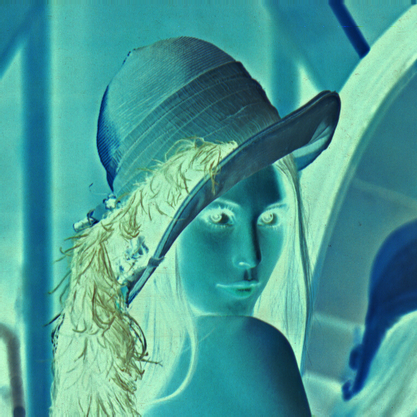

# Raw BMP Image Processor in C++


## Gallery

| Original | Sobel Edge Detection | Gaussian Blur (15x) |
| :---: | :---: | :---: |
|  |  |  |

| Sepia Tone | Grayscale | Negative |
| :---: | :---: | :---: |
|  |  |  |

---

A low-level image processing engine developed in C++. This project explores binary file manipulation, the internal structure of the BMP (Bitmap) format, and the implementation of mathematical kernels for computer vision.

## About the Project

This project implements a processor capable of reading, modifying, and writing BMP files from scratch without external libraries. It handles the raw byte stream of the image, managing headers, pixel padding, and color channels (BGR/BGRA) manually.

**Main Objectives:**
* Understand the binary structure of BMP headers (`BITMAPFILEHEADER` and `BITMAPINFOHEADER`).
* Manually manage memory buffers using `std::vector<uint8_t>` to store and manipulate raw pixel data.
* Implement spatial filters using **Convolution Kernels** (Gaussian Blur and Sobel Edge Detection).
* Handle alignment and padding requirements (4-byte boundary) for BMP file integrity.

The architecture uses a `BMP` class to encapsulate the file data, providing a clean interface to apply multiple artistic and technical filters.

## Technologies

* **Language:** ISO C++17
* **Compiler:** g++

## How to Build and Run

### Prerequisites

Ensure you have a C++ compiler installed (g++ or clang). This project is cross-platform but was tested primarily in Unix-like environments.

#### Linux Dependencies (Debian/Ubuntu)
```bash
sudo apt-get install g++
```
#### Compiling & Running

```bash
g++ main.cpp -o imageproc

./imageproc <input_file.bmp> <effect> <output_file.bmp>

Example: ./imageproc lena.bmp edge output.bmp
``` 

## Available Effects

### Gaussian Blur
* **Option:** `gausianblur`
* **Description:** Applies a 3x3 Gaussian kernel iteratively (15x) to create a smooth, cinematic bokeh effect. It acts as a low-pass filter to reduce noise.

### Grayscale
* **Option:** `grayscale`
* **Description:** Converts the image to black and white using the Luma transform formula ($Y = 0.299R + 0.587G + 0.114B$) to preserve human-perceived brightness.

### Sobel Edge Detector
* **Option:** `edge`
* **Description:** The "Grand Finale" filter. It calculates the intensity gradient in both X and Y directions using convolution to highlight high-frequency boundaries (edges).

### Sepia Tone
* **Option:** `sepia`
* **Description:** An artistic filter that applies a weighted average to pull colors toward warm, earthy tones, simulating 19th-century photography.

### Negative
* **Option:** `negative`
* **Description:** Inverts every color channel ($255 - pixel\_value$), creating a classic film negative aesthetic.

### Threshold
* **Option:** `threshold`
* **Description:** A binary filter that turns pixels into pure black or pure white based on a defined luminosity limit.
```
📁 Project
├── 📄 main.cpp        # Entry point: Argument parsing and filter execution
├── 📄 bitmap.hpp      # BMP Class definition: Headers, Pixel data, and Filter logic
└── 📁 assets/         # Project screenshots and demo results
```

# Resources
Here are some resources that I have used for this project to be able to work
[Técnicas básicas para Processamento de Imagens e Visão Computacional](http://www.lps.usp.br/hae/apostila/basico-ead.pdf)

[Solarian Programmer - C++ reading and writing BMP images](https://solarianprogrammer.com/2018/11/19/cpp-reading-writing-bmp-images/)

[Gausian Blur - Wikipedia](https://en.wikipedia.org/wiki/Gaussian_blur)

[Convolution Kernel - Wikipedia](https://en.wikipedia.org/wiki/Kernel_(image_processing))

[C++ Libraries and methods](https://cplusplus.com/reference/)

# Reminder
This project was developed for educational purposes to understand low-level data manipulation. Since it handles raw pointers and binary offsets, it serves as a foundation for learning computer vision and memory safety in C++.

I will continue to improve this engine, with plans to add multithreaded processing (OpenMP), [maybe] GPU Optimizations and support for more complex formats in the future.